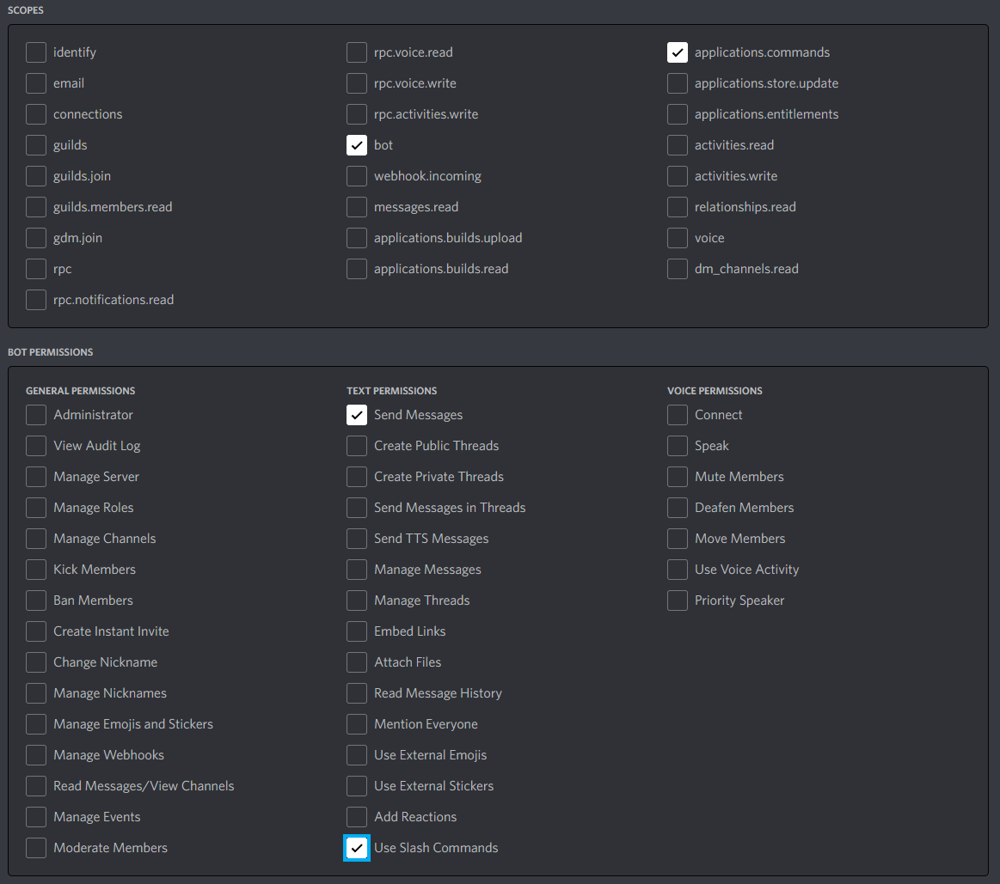

# Final Fantasy XIV Loot Distribution Bot
This python-based Discord bot for the game "Final Fantasy XIV" is meant to shave some time off loot distribution in coordinated raid groups.

### The Problem
In Final Fantasy XIV, loot drops from raids are semi-randomized coffers. These coffers can be opened by any player to receive an item for their class corresponding to the item slot of the coffer. In coordinated raid groups (statics), most often, the distribution within the group is decided in one of three ways:  
- Everyone rolls on any item they want to have.
- Coffers are distributed by the raid leader in a way that maximizes DPS gain for the group.
- Coffers are distributed by the raid leader so that everyone gets roughly the same amount of useful loot.

While the first distribution method is easily handled using the in-game roll system, the other two are not so easy. Distributing by DPS means someone has to keep track of the BiS gear for every player, and distributing in an equal way means having to keep track of who got which amount of loot, and who had to pass on useful loot the most.

In practice, this problem is often handled by excel sheets or by simply talking it out after completing a fight. With this tool, the goal is to automate and simplify this process a bit further.

### Setup
The bot is simply started using the `main.py` file with Python 3 (tested using Python 3.9). It requires the packages defined in the `requirements.txt` file to be installed, for example using `pip install -r requirements.txt`.

Additionally, the bot requires one environment variable `BOT_TOKEN`. To acquire this variable, you need to create an application on the [Discord Developer Portal](https://discord.com/developers/), then create a Bot for the given application and copy the token. Invite the bot to your server using the OAuth2 => URL Generator. 

The bot needs to have the scopes and permissions listed below.

### Usage
The bot uses slash commands. When first registering the application and starting the bot, according to Discord, it may take up to 1 hour for slash commands to propagate to all your servers.

The bot only uses three commands:
- **/info** to display a persistent info dialogue
- **/create [team_name] [leader_name]** to create a team (only usable in DMs)
- **/join [team_id] [player_name]** to join an existing team (only usable in DMs)

When using the /create or /join commands, a persistent discord view will be posted to the corresponding direct message channel. This view can then be used to interact with the bot.

When assigning loot as a team leader, if you selected the loot priority mode "DPS" or "Equal", you will see a priority list based on previous distributed loot and the BiS selection of your team members. This way, you instantly know who should receive the loot based on the given distribution, but you also have the option of going against the recommendation.

"DPS" loot priority prioritizes giving loot to DPS > Tanks > Healers, and within the role, prioritizes those who have marked the slot as a higher upgrade.

"Equal" loot priority uses a pity system. When a player receives a piece of gear, all other players who could have used that piece of gear receive pity equal to the stat value of the item (4 for accessories, 6 for minor left side upgrades and 8 for large left side upgrades and weapon). When a new piece drops, between those players who need the item, regardless of how much of an upgrade it is, pity is used to decide who gets the item. Only when pity is equal, the value of the upgrade is used as a tiebreaker.

You have one more option when using the Bot, which is a parameter in the `main.py` file's `DiscordBot` constructor. If you set `load_config` to False, then all team information will get lost when the bot restarts. Otherwise, it will be stored in a `TeamData.obj` file and retrieved on the next start. 

For more information and usage examples, check out the video below.

[Demo Video](https://www.youtube.com/watch?v=cjLgK5VGuig)